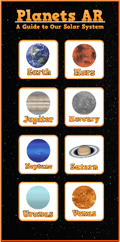
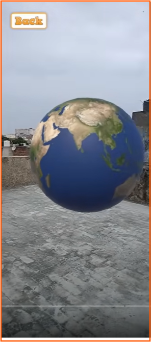

# 🌌 Planets AR

**Planets AR** is an awe-inspiring augmented reality app that allows users to explore the stunning beauty of our solar system's planets. Using a smartphone or tablet, the app brings the planets to life, offering an up-close and detailed view of their unique features. From the intricate patterns on Jupiter to Saturn's majestic rings and Mars' red landscapes, PlanetsAR provides an immersive and seamless experience. With educational content and fascinating facts about each planet, it's a fantastic tool for learning and igniting curiosity about our universe. Whether you're a space enthusiast or simply captivated by the cosmos, PlanetsAR offers an unforgettable journey through space in the palm of your hand.

## 🚀 Features

- 🌍 View 3D models of planets in AR
- 🪐 Learn interesting facts about each planet
- 🔭 Intuitive interface for a fun learning experience
- 🎓 Designed for students and curious minds

## 🛠 Development Tools

- **Unity** 2020
- **ARFoundation** (Unity's AR abstraction layer)
- **ARCore** (Google’s AR SDK for Android)

## 📱 Platforms

- Android (ARCore-supported devices)

## 📸 Screenshots

 


## 📦 Installation

1. Clone the repository  
   ```bash
   git clone https://github.com/NourBen0/Planets-AR.git
